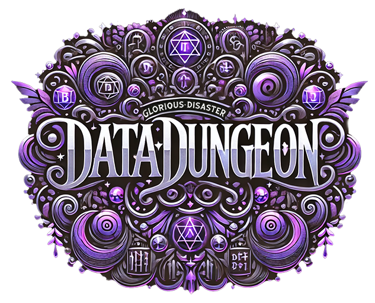

# Data-Dungeon

Welcome to the **Data-Dungeon**, where glorious chaos meets disastrous brilliance! 🎉

This is my repository for storing all my ideas—big, small, brilliant, and gloriously disastrous. It's a place for experimentation, learning, and a little bit of madness.

## What You'll Find Here

- 🗃️ Random scripts and tools
- 🧪 Experimental code and projects
- 📜 Notes, thoughts, and ideas
- 🛠️ Works in progress (and plenty of glorious failures)

## Why "Data-Dungeon"?

Because it's a treasure trove of ideas and experiments, with a little chaos mixed in. Some ideas may shine like gold, others may haunt you like a cursed artifact—but they all have a place here.

---

Feel free to explore, learn, laugh, and (hopefully) find some inspiration. Beware: the Data-Dungeon is not for the faint of heart.

🚀 Let the chaos begin!
