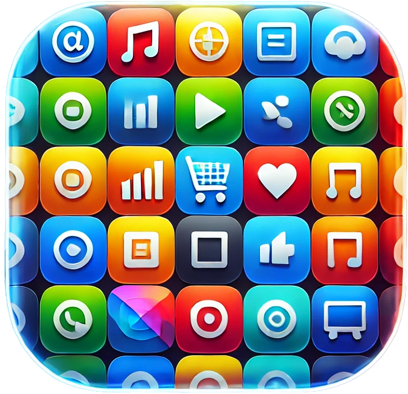

---

# Apps

This folder is dedicated to my experiments and creations in the world of applications. Whether they're glorious works of art or disastrous failures, they all start here.

## What's Inside?
- 📱 Mobile app ideas and prototypes
- 💻 Desktop applications and tools
- 🌐 Web apps and frameworks
- 🛠️ Utility scripts to power apps

## Philosophy
These apps may not change the world, but they'll certainly add some glorious chaos to it. Use them, improve them, or just marvel at their eccentricity.
