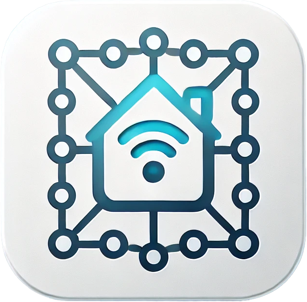

---

# Home Assistant

This folder contains all my Home Assistant configurations, automations, and
experiments. Explore my glorious attempts to bring chaos (and order) to smart home
automation.

## Contents

- ⚙️ YAML configurations
- 📊 Automation scripts
- 🏡 Custom integrations

Let the home automation adventures begin!
