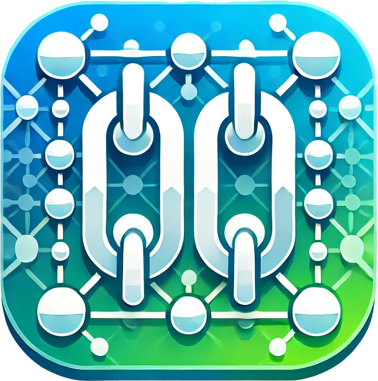

# Links

This folder is a curated collection of useful, inspiring, or just plain
interesting links. It's a treasure trove of resources for learning,
troubleshooting, or diving down rabbit holes.

## Contents

- 🌐 References to tutorials and guides
- 📖 Documentation and knowledge bases
- 🔗 Links to tools, libraries, and repositories

These links are my lifeline to the glorious world of knowledge. Explore at your
own peril!
