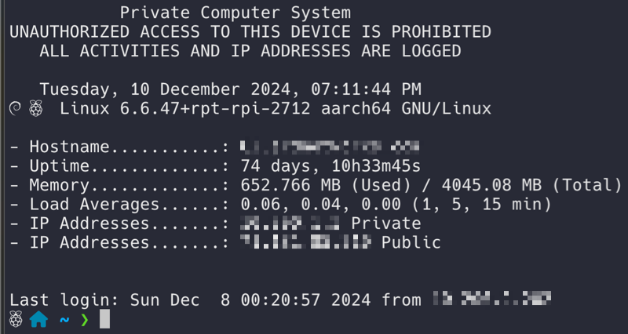

# Dynamic MOTD Upon SSH Logon on Debian

## 

When SSH-ing into a Debian server, the dynamic Message of the Day (MOTD) can be
displayed by leveraging PAM (Pluggable Authentication Modules) and dynamic scripts.

### 1. `sshd_config` Configuration The SSH Daemon (`sshd`) is Configured to U

se PAM for session handling:

The SSH daemon (`sshd`) is configured to use PAM for session handling:
_This is enabled in `/etc/ssh/sshd_config`._

```bash
PrintMotd no # If you enable this it will duplicate motd
UsePAM yes
```

### 2. PAM and MOTD

PAM references the `pam_motd.so` module in `/etc/pam.d/sshd`:

```bash
session optional pam_motd.so motd=/run/motd.dynamic
```

This points to the dynamic MOTD file at `/run/motd.dynamic`.

### 3. Dynamic MOTD Updates

The file `/run/motd.dynamic` is updated by executable scripts in `/etc/update-mo
td.d/`. These scripts run automatically on each SSH login, generating real-time system info or custom messages to display in the MOTD.

This setup allows for dynamic, customizable login messages via SSH.

#### `/run/motd.dynamic` **example**

```text
           Private Computer System
UNAUTHORIZED ACCESS TO THIS DEVICE IS PROHIBITED
   ALL ACTIVITIES AND IP ADDRESSES ARE LOGGED

   Sunday,  8 December 2024, 12:20:57 AM
   Linux 6.6.47+rpt-rpi-2712 aarch64 GNU/Linux

- Hostname...........: host.example.com
- Uptime.............: 71 days, 15h42m58s
- Memory.............: 651.625 MB (Used) / 4045.08 MB (Total)
- Load Averages......: 0.03, 0.03, 0.00 (1, 5, 15 min)
- IP Addresses.......: 10.0.0.205 Private
- IP Addresses.......: 0.39.43.4 Public
```

#### `/etc/update-motd.d/10-file` _example script._

```bash
#!/bin/bash
let upSeconds="$(/usr/bin/cut -d. -f1 /proc/uptime)"
let secs=$((${upSeconds}%60))
let mins=$((${upSeconds}/60%60))
let hours=$((${upSeconds}/3600%24))
let days=$((${upSeconds}/86400))
UPTIME=`printf "%d days, %02dh%02dm%02ds" "$days" "$hours" "$mins" "$secs"`

# get the load averages
read one five fifteen rest < /proc/loadavg

echo "
$(tput setaf 1)           Private Computer System
$(tput setaf 1)UNAUTHORIZED ACCESS TO THIS DEVICE IS PROHIBITED
$(tput setaf 1)   ALL ACTIVITIES AND IP ADDRESSES ARE LOGGED
$(tput setaf 2)
   `date +"%A, %e %B %Y, %r"`
$(tput setaf 1)  $(tput setaf 2) `uname -srmo`"

if [ $(df / --output='pcent' | grep -o "[0-9]*") -gt 80 ]; then echo "$(tput set
af 3)------------ LOW DISK SPACE ------------"; fi
echo

echo "$(tput sgr0)- Hostname...........: `hostname`
$(tput sgr0)- Uptime.............: ${UPTIME}
$(tput sgr0)- Memory.............: `free | grep Mem | awk '{print $3/1024}'` MB
(Used) / `cat /proc/meminfo | grep MemTotal | awk {'print $2/1024'}` MB (Total)
$(tput sgr0)- Load Averages......: ${one}, ${five}, ${fifteen} (1, 5, 15 min)
$(tput sgr0)- IP Addresses.......: `hostname -I | /usr/bin/cut -d " " -f 1` $(tp
ut setaf 2)Private
$(tput sgr0)- IP Addresses.......: `curl -s ifconfig.me | tail` $(tput setaf 2)P
ublic
$(tput sgr0)"
```

## More Details

### **What Happens During Login**

1. PAM reads `/run/motd.dynamic` to display the MOTD to the user.
2. If the scripts in `/etc/update-motd.d/` need to be re-run (e.g., after updates), a mechanism (like cron, systemd, or login triggers) executes `run-parts` to regenerate `/run/motd.dynamic`.

### **How to Verify `run-parts` Usage**

**Check MOTD Update Behavior:**

- Test manually:

```bash
run-parts /etc/update-motd.d/
```
